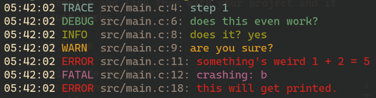

# nhlog

An extremely simple logging library for C/C++ with colors.

# Installation
Just include the two files `nhlog.h` and `nhlog.c` with your project files and make sure to compile and link them with your project and it just works.

# Usage
```c
#include "nhlog.h"
int main() {
  nhlog_trace("step 1");

  nhlog_debug("does this even work?");
  char *answer = "yes";
  nhlog_info("does it? %s", answer);
  nhlog_warn("are you sure?");

  nhlog_error("something's weird %d + %d = %d", 1, 2, 5);
  nhlog_fatal("crashing: %c", 'b');

  // set global logging level.
  nhlog_set_level(NHLOG_ERROR);

  nhlog_trace("won't get printed.");
  nhlog_debug("this won't either.");
  nhlog_error("this will get printed.");
}
```
this outputs:




# Why?
Because every other C/C++ logging library is either
- overly complicated for small projects
- doesn't support both c and c++
- doesn't have colors 
- doesn't have simple api