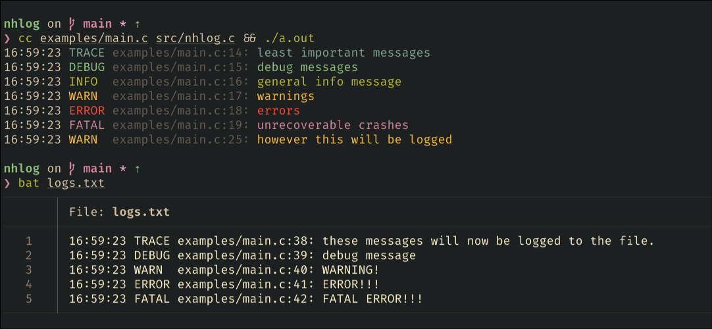

# nhlog

An extremely simple logging library for C/C++ with colors.

# Installation

Just include the two files `nhlog.h` and `nhlog.c` with your project files and make sure to compile and link them with your project and it just works.

```

# Usage

```c
#include "nhlog.h"
#include <stdio.h> // for NULL

int main() {
  // This needs to be called ATLEAST once before start logging.
  //
  // First parameter is the initial logging level.
  //
  // Second parameter is the outstream to write to, NULL can be passed to log to
  // stderr
  nhlog_init(NHLOG_TRACE, NULL);

  // After init there are different macros to log for different log levels.
  nhlog_trace("least important messages");
  nhlog_debug("debug messages");
  nhlog_info("general info message");
  nhlog_warn("warnings");
  nhlog_error("errors");
  nhlog_fatal("unrecoverable crashes");

  // Logging level can be changed at runtime using:
  nhlog_set_level(NHLOG_INFO);
  nhlog_trace("this will be NOT be logged");
  nhlog_debug("same for this");
  nhlog_warn("however this will be logged");

  // All logging can be disabled by setting log level to NHLOG_OFF
  nhlog_set_level(NHLOG_OFF);
  nhlog_trace("this will be NOT be logged");
  nhlog_debug("same for this");
  nhlog_fatal("and same for this");
  nhlog_set_level(NHLOG_TRACE);

  // you can log to any stream by passing it to nhlog_set_outstream
  void *fd = fopen("logs.txt", "w");
  nhlog_set_outstream(fd);

  nhlog_trace("these messages will now be logged to the file.");
  nhlog_debug("debug message");
  nhlog_warn("WARNING!");
  nhlog_error("ERROR!!!");
  nhlog_fatal("FATAL ERROR!!!");

  return 0;
}
```

this outputs:



# Why?

Because every other C/C++ logging library is either

- overly complicated for small projects
- doesn't support both c and c++
- doesn't have colors
- doesn't have simple api
